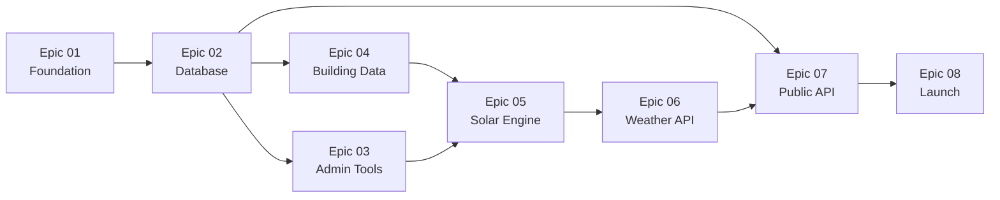

# Sunny Seat - Epic Structure

## Project Overview
This directory contains the complete epic breakdown for the Sunny Seat project, transforming the high-level milestones from the PRD into sprintable development units.

## Epic Sequence & Dependencies

### Phase 1: Foundation (Weeks 1-4)
- **[Epic 01: Project Foundation](./epic-01-project-foundation.md)** - Project setup, dev environment, basic structure
- **[Epic 02: Database Foundation](./epic-02-database-foundation.md)** - Schema, migrations, data access layer

### Phase 2: Core Data & Admin (Weeks 5-8)  
- **[Epic 03: Admin Tooling](./epic-03-admin-tooling.md)** - Polygon editor, venue management, quality flags
- **[Epic 04: Building Data Import](./epic-04-building-data-import.md)** - GDAL integration, building footprints

### Phase 3: Algorithms & Intelligence (Weeks 9-10)
- **[Epic 05: Solar & Shadow Engine](./epic-05-solar-shadow-engine.md)** - Solar calculations, shadow casting, precomputation
- **[Epic 06: Weather Integration](./epic-06-weather-integration.md)** - Yr/Met.no API, confidence blending

### Phase 4: Public Features & Launch (Weeks 11-12)
- **[Epic 07: Public API & Core Frontend](./epic-07-public-api-core.md)** - REST endpoints, React app, user features
- **[Epic 08: Launch Readiness](./epic-08-launch-readiness.md)** - Monitoring, performance, SEO, deployment

## Epic Metrics Summary

| Epic | Stories | Estimated Effort | Key Dependencies |
|------|---------|------------------|------------------|
| 01 - Foundation | 3 | 1 week | Visual Studio, .NET Framework 4.8 |
| 02 - Database | 4 | 1 week | PostgreSQL + PostGIS |
| 03 - Admin Tools | 5 | 2 weeks | MapLibre GL, Authentication |
| 04 - Building Import | 5 | 1 week | GDAL, Lantmäteriet data |
| 05 - Solar Engine | 5 | 2 weeks | Spatial libraries, Math libraries |
| 06 - Weather API | 5 | 1 week | Yr/Met.no API access |
| 07 - Public Features | 8 | 3 weeks | React, API foundation |
| 08 - Launch | 8 | 1 week | Azure, Monitoring tools |

**Total**: 43 stories across 8 epics, 12-week timeline

## Dependencies Between Epics

## Success Criteria
- Each epic delivers working, testable functionality
- Dependencies between epics are clearly managed
- Regular integration testing ensures compatibility
- Epic completion enables immediate value delivery
- Total timeline aligns with PRD milestones (12 weeks)

## Next Steps
1. Begin Epic 01 - Project Foundation immediately
2. Establish development team sprint cadence (1-2 week sprints)
3. Set up epic-level tracking and reporting
4. Plan inter-epic integration points and testing